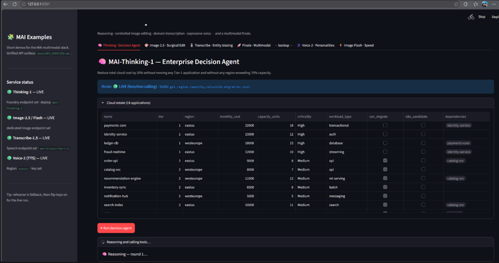

# mai-foundry-demos

A compact Streamlit app that showcases the Microsoft MAI multimodal stack through short,
focused demos designed for a 30–45 minute presentation.

Each demo illustrates one capability and can run in one of two modes:

- **🟢 LIVE** — uses real MAI APIs when credentials are present in `.env`
- **🟡 FALLBACK** — uses deterministic offline stand-ins so you can rehearse without
  keys and so a live hiccup on stage degrades gracefully

The API surface used here was checked against Microsoft Learn on 2026-08-25. See
[docs/API_VERIFIED.md](docs/API_VERIFIED.md) for the details.

## What the user will see

A quick preview of the experience presented by the demo app:



## What this repository demonstrates

These are four selected MAI capabilities, not an exhaustive catalog of the MAI family.

The app is organized around four main story beats and a finale:

| Demo | What it shows | Typical setup |
|---|---|---|
| 🧠 Thinking · Decision Agent | Tool-using reasoning over a cloud estate and migration constraints | Foundry resource |
| 🎨 Image · Surgical Edit | Controlled image editing with preservation-oriented prompts | Foundry image resource |
| 🎙️ Transcribe · Entity biasing | Domain-aware transcription with phrase biasing and verbatim mode | Speech resource |
| 🗣️ Voice · Personalities | Expressive TTS with multiple styles and languages | Speech resource |
| 🚀 Finale · Multimodal | End-to-end flow: speech → reasoning → image → speech | Combination of the above |

Backup demos are also included for extra flexibility: Voice personalities and faster image generation.

## Quick start

### Windows PowerShell

```bash
# 1. From the project root, create a virtual environment
python -m venv .venv
.\.venv\Scripts\Activate.ps1        # PowerShell (Windows)

# 2. Install
pip install -r requirements.txt

# 3. (Optional) Build the base product image for the edit demo
python assets/build_assets.py

# 4. (Optional) Add credentials to go LIVE
copy .env.example .env               # then edit .env

# 5. Run
streamlit run app.py
```

### macOS / Linux

```bash
python3 -m venv .venv
source .venv/bin/activate
python -m pip install -r requirements.txt
python assets/build_assets.py             # optional
cp .env.example .env                      # optional; then edit .env
streamlit run app.py
```

With no `.env`, the default `demo` mode runs in **FALLBACK** mode.

### Execution modes

- `MAI_EXECUTION_MODE=demo` (default) labels and uses deterministic fallback output
  when credentials are absent or a live call fails.
- `MAI_EXECUTION_MODE=strict` raises missing-configuration and live API failures;
  it never silently substitutes mock output. Use strict mode for authorized preflight checks.

## Going LIVE

Fill any subset of `.env` (see [`.env.example`](.env.example)). Each demo checks
its own credentials, so you can, e.g., run Thinking + Image live while Transcribe
stays in fallback.

| Demo | Needs | Env |
|---|---|---|
| Thinking-1 | Foundry resource | `MAI_FOUNDRY_ENDPOINT`, `MAI_FOUNDRY_API_KEY`, `MAI_THINKING_DEPLOYMENT` |
| Image-2.5 / Flash | Foundry resource (image-capable region) | `MAI_IMAGE_ENDPOINT`, `MAI_IMAGE_API_KEY`, deployment names |
| Transcribe-1.5 | Speech resource | `MAI_SPEECH_ENDPOINT`, `MAI_SPEECH_KEY` |
| Voice-2 (TTS) | Speech resource | `MAI_SPEECH_KEY`, `MAI_SPEECH_REGION` |

Deploy the models in the Foundry portal / Azure CLI first; the `model` field in
each call is the **deployment name** you assign. `.env` is gitignored — never commit
real keys.

Prefer infrastructure as code? [`infra/main.bicep`](infra/main.bicep) can deploy the
whole Foundry resource — `MAI-Thinking-1`, `MAI-Image-2.5`, and `MAI-Image-2.5-Flash` —
in one `az deployment group create`. See [`infra/README.md`](infra/README.md) and
confirm current model/region availability in your own subscription before deployment.

### How the models are called

The sample uses two service surfaces, both reached over HTTPS:

- **Thinking and Image** are model deployments on Microsoft Foundry `AIServices`
  resources.
- **Transcribe and Voice** are consumed through Azure Speech APIs in Foundry Tools.

The four capabilities are called as follows:

- **Thinking-1** → `POST {endpoint}/mai/v1/chat/completions` (`api-key` header, SSE
  streaming, `tools` function calling, `max_completion_tokens`, and
  `reasoning_display` for encrypted reasoning state across tool rounds).
- **Image-2.5 / Flash** → `POST {endpoint}/mai/v1/images/edits` and `/generations`
  (edits are multipart; responses are base64 PNG).
- **Transcribe-1.5** → the Speech **LLM Speech API**
  `POST {speech-endpoint}/speechtotext/transcriptions:transcribe`, with a `phraseList`
  for entity biasing.
- **Voice-2** → the Speech **REST TTS** `POST {region}.tts.speech.microsoft.com/cognitiveservices/v1`
  with SSML `mstts:express-as` styles.

Chat, image, and speech can use separate configuration — which is why
`MAI_FOUNDRY_*`, `MAI_IMAGE_*`, and `MAI_SPEECH_*` are configured independently. This
also lets Image use a different resource when required by current regional availability.

The 2026-08-25 hardening pass used current Microsoft Learn documentation and offline CI
only; it did **not** call a live Azure endpoint. Live verification was run separately
against an authorized East US Foundry resource: the strict smoke script passed for all
four service areas on 2026-08-27, and the image generation and edit in
[`docs/IMAGE_PRESERVATION.md`](docs/IMAGE_PRESERVATION.md) were measured live on
2026-08-28. Full API details and sources:
[`docs/API_VERIFIED.md`](docs/API_VERIFIED.md).

## Notes on the MAI lineup (worth knowing)

A few things that came up while verifying against Microsoft's public docs (all
captured in [`docs/API_VERIFIED.md`](docs/API_VERIFIED.md)):

- **Transcribe naming.** The selected demo uses the currently documented
  `mai-transcribe-1.5` identifier rather than names from older materials.
- **Preview status.** Microsoft Learn currently labels MAI-Thinking-1 and the selected
  Image / Transcribe / Voice capabilities as preview. Preview capabilities can change;
  check the linked documentation before relying on them.
- **Image deployment names are configurable.** The generation demo defaults to
  `MAI-Image-2.5-Flash`; check the model catalog before creating a deployment.
- **Voice styles are voice-dependent.** `mstts:express-as` styles vary by voice — e.g.
  `empathy` exists on `es-ES-Marta` and the multilingual voices, not on the en-US
  voices (which offer `excited`, `hopeful`, `softvoice`, …). The app validates the
  requested style against the voice and falls back to the closest supported one.

## Project layout

```
app.py                     Streamlit entry (4 main tabs + 2 backup tabs)
mai/                       Shared client library
  config.py                Env config, endpoints, voice/style registry
  client.py                MAIClient — pluggable LIVE + FALLBACK for all 4 families
  ssml.py                  SSML builder + style validation
  fallback.py              Deterministic offline stand-ins
demos/                     One module per demo (each exposes render(client))
assets/
  data/                    cloud_estate.json, region_capacity.json (Thinking demo)
  build_assets.py          Generates the base product image
docs/
  API_VERIFIED.md          Verified API surface (with sources)
  PROMPTS.md               Every demo prompt, ready to copy/paste
  IMAGE_PRESERVATION.md    What the image edit actually preserved, measured
scripts/
  live_smoke.py            Strict preflight against all four services
  measure_preservation.py  Reproduces the numbers in IMAGE_PRESERVATION.md
tests/                     Offline smoke tests (pytest, no credentials)
infra/                     Bicep template to deploy the Foundry resource + model deployments
.github/workflows/ci.yml   Lint (ruff) + offline tests on every push / PR
```

## Tests

The suite runs fully offline in FALLBACK mode — no credentials, no network:

```bash
pip install ruff pytest
ruff check .
ruff format --check .
pytest
```

CI (`.github/workflows/ci.yml`) runs the same lint + tests on every push and PR.

## Notes

- HTTP is plain `requests`, matching the Microsoft REST docs one-to-one (no SDK
  coupling). Swap in the OpenAI SDK or Azure Speech SDK if you prefer.
- Audible offline voice fallback uses `pyttsx3` (OS TTS) if installed; otherwise
  the demo shows the valid SSML and no audio.
- Fallback outputs are always labelled as mock — never presented as real model output.
